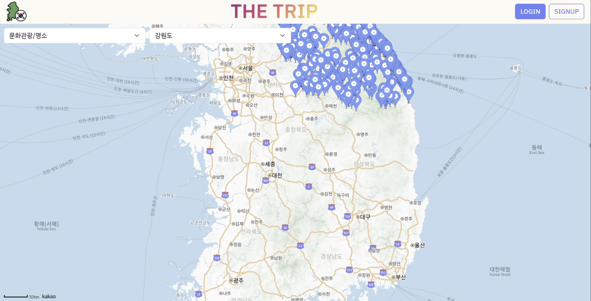
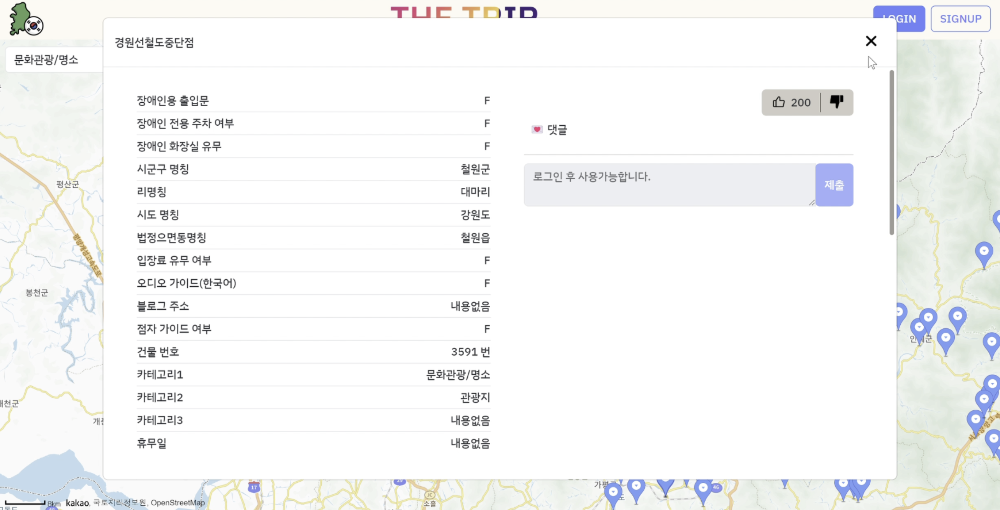
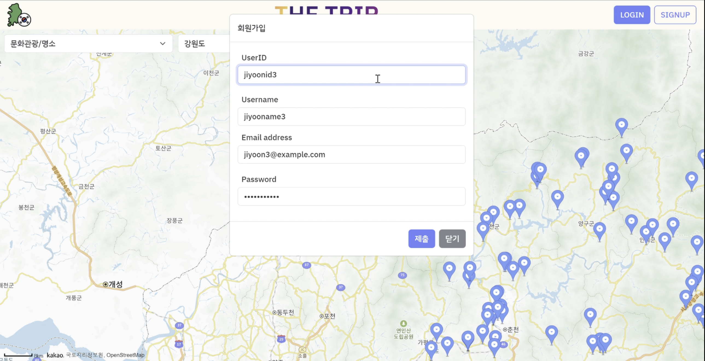
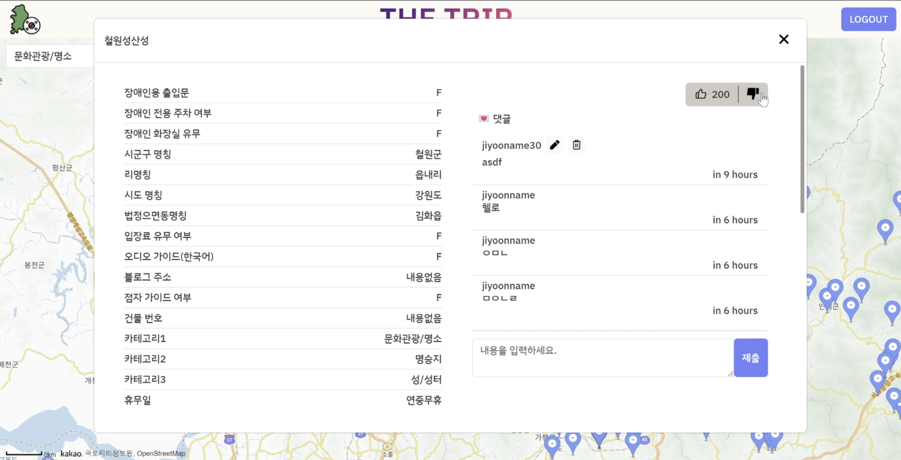

# the trip
## 프로젝트 설명
지역별 관광지, 문화시설을 지도 앱을 통하여 한눈에 볼 수 있는 여행 플랫폼

## 프로젝트 기간
2023.08.16 ~ 2023.8.25

## 사용 기술
OracleDB, PL/SQL

### 백엔드
- python
- flask
- swagger 
▼ 파일구조 설명 
  

### 프론트엔드
- Vue3(composition api)
- pinia
- vue-router
- bootstrap5
- eslint
- prettier 

## 주요기능
  1. 전국 각지의 관광시설 표시
  2. 카테고리와 위치별로 관광시설을 필터링
  3. 상세정보를 모달로 표시
      - 관광시설 상세정보
      - 댓글
      - 좋아요
  4. 로그인/로그아웃
  5. 회원가입
  6. 상세 모달에서 댓글을 조회한다.(로그인 불필요)
  7. 댓글에서 작성, 수정, 삭제를 할 수 있다.(로그인 필요)
  8. 상세 모달에서 좋아요, 싫어요 조회 (로그인 불필요)
  9. 좋아요, 싫어요 작성(로그인 필요)

## 데이터베이스
### 관계 요구사항 분석
1. Facility테이블과 Facility_Info는 1:1 관계를 가진다.
2. Facility 테이블은 Faclity_Info를 필수적으로 가져야한다.
3. Facility_Info 테이블은 Faclity테이블을 필수적으로 가져야한다.
4. Faclity테이블과 Comment테이블은 1:n관계다.
5. Faclity테이블은 0개 이상의 Comment를 가질 수 있다.
6. Facility테이블은 Comment테이블을 필수로 가지지않아도 된다.
7. Comment테이블은 Facility테이블을 필수적으로 가져야한다.
8. User테이블과 Comment테이블은 1:n 관계다.
9. User테이블은 0개 이상의 Comment를 가질 수 있다.
10. User테이블은 Comment 테이블을 필수적으로 가지지않아도 된다.
11. Comment 테이블은 User테이블을 필수적으로 가져야 한다.
12. Faclity테이블과 Preference테이블은 1:n 관계다.
13. Faclity테이블은 0개 이상의 Preference를 가질 수 있다.
14. Faclity 테이블은 Preference를 필수적으로 가지지 않아도 된다.
15. Facility테이블은 Preference테이블을 필수로 가지지않아도 된다.
16. Preference테이블은 Facility테이블을 필수적으로 가져야한다.
17. User테이블과 Preference테이블은 1:n 관계다.
18. User테이블은 0개 이상의 Preference를 가질 수 있다.
19. User테이블은 Preference 테이블을 필수적으로 가지지않아도 된다.
20. Preference 테이블은 User테이블을 필수적으로 가져야 한다.

### 논리모델

### 관계모델

## UI 캡처

